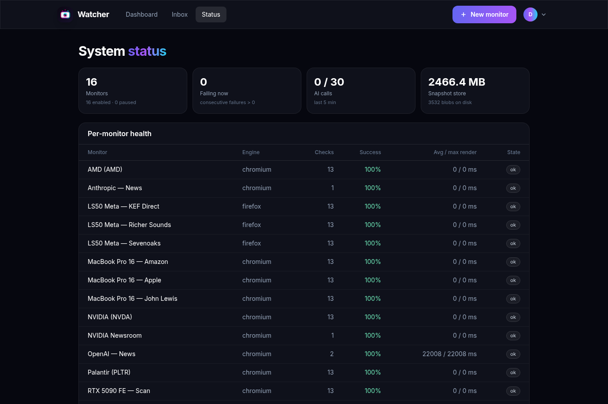
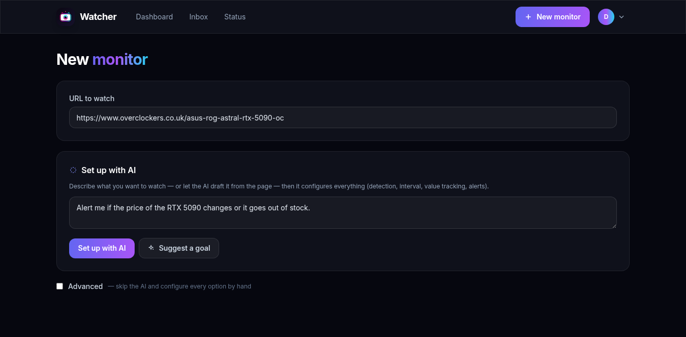
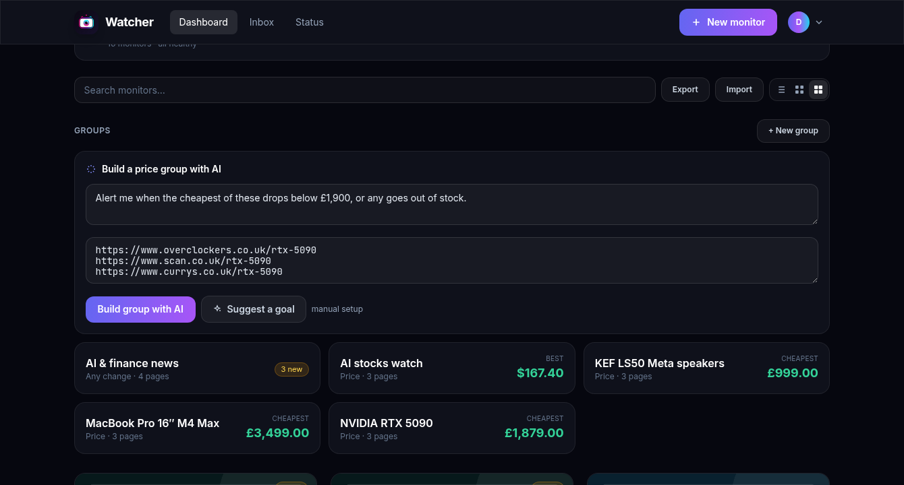
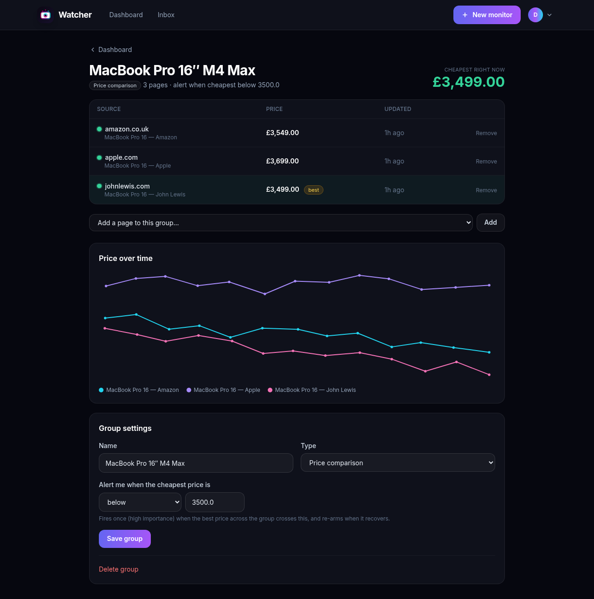
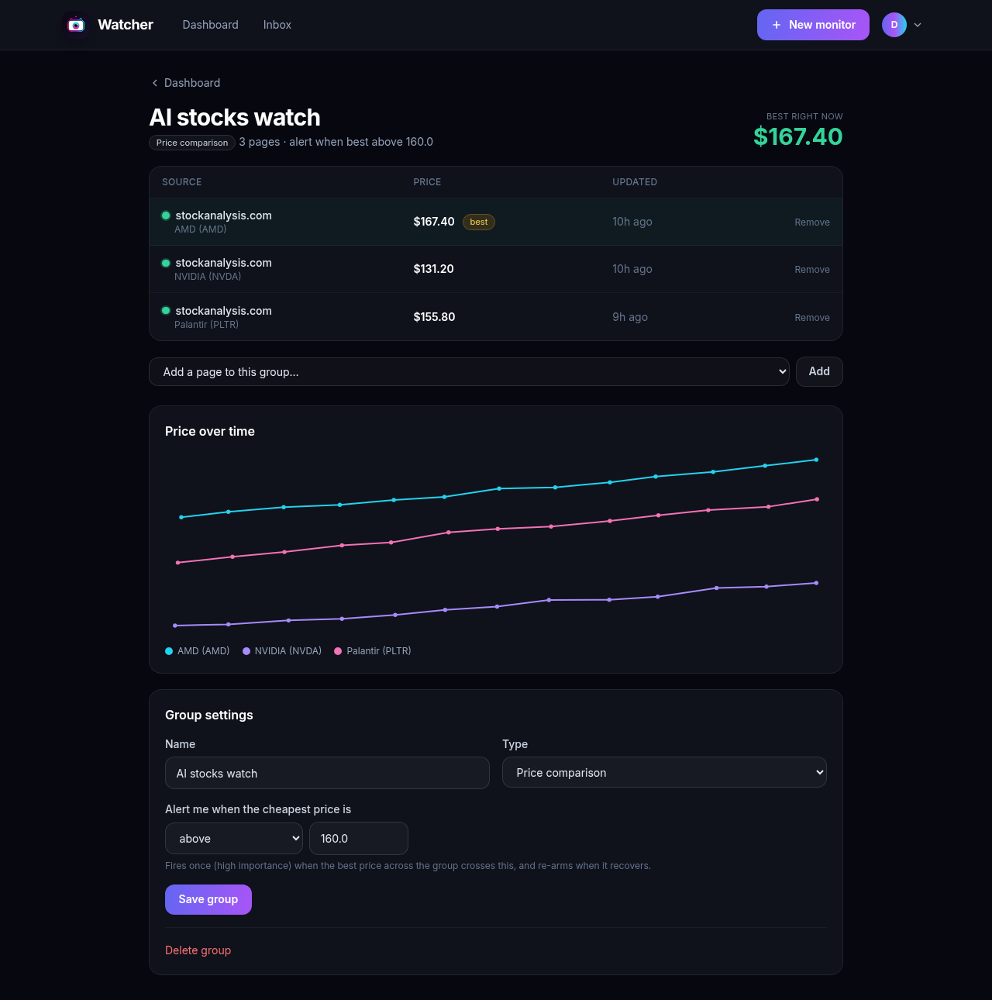
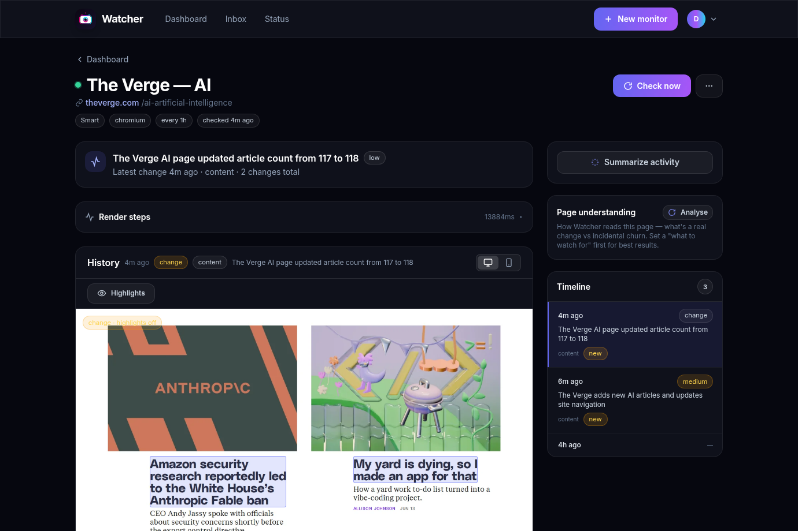
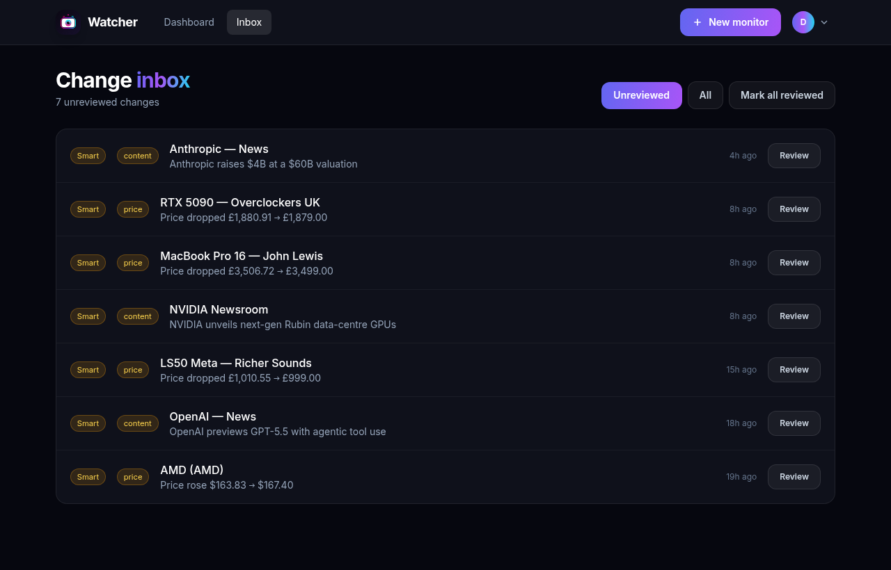

<p align="center">
  
</p>

<p align="center">
  <strong>A self-hosted tool to monitor any website or URL for changes — and tell you the moment something moves.</strong>
</p>

<p align="center">
  Pages are rendered in a <em>real browser</em> (Playwright / Camoufox), so JavaScript-heavy and
  anti-bot–protected sites work where naïve HTML-diff scrapers fail.
</p>

<p align="center">
  <a href="https://github.com/JameZUK/Watcher/actions/workflows/ci.yml"></a>
  
  
  
  
</p>

---

## ✨ Features

- **Smart detection (default)** — watches a page's **content (text) and appearance (visual) together**, and shows you both in a tabbed diff. Other modes: rendered **text**, **visual** (screenshot), single **element** (CSS/XPath), raw **HTML**, and **JSON**.
- **Real browser rendering** — Chromium / Firefox / WebKit via Playwright, plus **[Camoufox](https://github.com/daijro/camoufox)** (stealth Firefox) for anti-bot targets. Desktop **and** mobile previews are captured each check.
- **Sees changes in place** — dashboard cards show live screenshot thumbnails; the diff viewer overlays **changed regions in red** on the actual page, with an interactive **before/after slider**, a scrubbable **history timeline**, and full-screen **zoom**.
- **Clickable links on every capture** — captures are screenshots, but Watcher extracts each page's hyperlinks from the DOM and floats **real clickable anchors** over the image, so you can jump straight from a snapshot to the live page (history view **and** zoom, desktop **and** mobile, opens in a new tab) — even on links that sit under a change highlight.
- **Group monitoring & price comparison** — group related pages (the **same product across retailers**) and watch them together: a side-by-side comparison with the **cheapest highlighted**, all prices on **one chart**, and a single group alert ("tell me when the cheapest drops below £X"). Groups aren't just for price — choose **back-in-stock**, **any-change**, or a **custom AI intent** that's combined with each page's own.
- **AI triage & setup** *(optional)* — an OpenRouter-hosted model (or any OpenAI-compatible / **Ollama** endpoint) writes a one-line **headline**, classifies the change (price / stock / content / cosmetic …), and rates **importance** so low-value churn is muted. It also **builds monitors and groups from a plain-English goal** ("track this across these retailers and alert me under £250") — or **drafts that goal for you straight from the page** (one click, then you edit) — **suggests what to watch for**, and **summarises** recent activity.
- **Value tracking & trends** — extract a numeric value (price, stock count, rating) each check, chart it over time, and fire **threshold alerts** ("tell me when it drops below £300").
- **Notifications** — in-app **inbox**, **Web Push**, **HMAC-signed webhooks**, **Email/SMTP**, **Telegram**, **Discord**, **ntfy**, **Pushover**, and **Home Assistant** (calls a notify service via the HA API) — with **hourly digests** and **quiet hours** so non-urgent changes batch up instead of pinging you at 3am.
- **Reliability & observability** — per-check render/detect timeouts, retries, **auto-pause** after repeated failures (with a recovery alert), **adaptive intervals**, **auto-escalation to stealth Camoufox** when a render is bot-walled, optional **automatic AI re-login** when a login session expires (credential logins, no captcha), and a **status page** (per-monitor success rate, render times, AI budget, blob-store size). A **per-step render trace** flags *degraded* captures and **auto-skips steps that repeatedly time out** (with per-monitor toggles), so one slow step never sinks the whole render.
- **Anti-bot & authenticated sites** — Camoufox stealth rendering with an automatic **site-root warm-up** that clears cold-deep-link walls (banks a clearance cookie, then retries with a same-site referer); blocked / challenge pages (DataDome, Cloudflare, PerimeterX, …) are detected and surfaced instead of silently failing; **paste Cookie Editor JSON** to reuse a logged-in session or clear a bot check; recorded **login flows**, **per-monitor proxies** and a health-checked **shared proxy pool**. Stored credentials and pasted session cookies are **encrypted at rest**.
- **Noise control** — ignore selectors, ReDoS-safe regex ignore patterns, a per-monitor minimum-change threshold, **and a global visual noise floor** that absorbs anti-aliasing, lazy-loaded images, and carousels so trivial pixel churn never alerts you.
- **Accounts, 2FA & admin** — multi-user with self-service **profile / password** changes and **TOTP two-factor auth** (authenticator app), plus an **admin panel** to create/manage users, toggle self-service signup, and **require 2FA** for everyone.
- **Organise & integrate** — **groups**, **tags** + search, three **dashboard views** (large / compact / list), JSON **import/export**, a token-authed **REST API**, an **RSS** feed, and a **browser extension** to add the current tab in one click.
- **Futuristic, fully-responsive UI** — dark glassmorphic design that works on desktop and mobile (pinch-to-zoom snapshots), with an **Auto / Full / Lite** effects toggle for devices without GPU acceleration.
- **Single container** — SQLite + a content-addressed blob store. No Redis, no Postgres, no external services.

## 📸 Screenshots

| Dashboard — monitors, groups & an AI fleet summary | Status — per-monitor health & resource use |
|---|---|
|  |  |

| Set up a monitor with AI — *draft the goal straight from the page* | …build a price group the same way |
|---|---|
|  |  |

| Grouped price comparison (cheapest highlighted) | Combined price trend across sources |
|---|---|
|  |  |

| Monitor detail — history, change highlights & render trace | Hyperlinks made clickable on the captured page |
|---|---|
|  |  |

| AI-triaged change inbox | Fully responsive on mobile |
|---|---|
|  |  |

> The demo above is generated by [`scripts/seed_demo.py`](scripts/seed_demo.py) on a `demo@watcher.local` account — product price groups, an AI-news group, and a triaged inbox.

## 🚀 Quick start (Docker)

```bash
git clone https://github.com/JameZUK/Watcher.git
cd Watcher
cp .env.example .env
# REQUIRED — the app refuses to start without a strong secret:
python -c "import secrets; print('WATCHER_SECRET_KEY=' + secrets.token_urlsafe(48))" >> .env
# RECOMMENDED — a stable key so stored credentials survive a secret rotation:
python -c "from cryptography.fernet import Fernet; print('WATCHER_ENCRYPTION_KEY=' + Fernet.generate_key().decode())" >> .env
mkdir -p data && chmod -R a+rwX data    # the container runs as uid 1001
docker compose up --build -d
```

Open **http://&lt;host&gt;:8000**, create the first account (it becomes the **admin**), and add your first monitor. The image bundles Playwright's Chromium / Firefox / WebKit **and** Camoufox, so every engine works out of the box.

## 🐳 Docker deployment (production)

The shipped [`docker-compose.yml`](docker-compose.yml) runs a single container as a **non-root** user (`pwuser`, uid 1001), reads secrets from `.env` on the host, and bind-mounts `./data` for the database and screenshot blobs.

**1 — Keys & secrets.** Set both in `.env` (see the Quick start above):

| Key | Why it matters |
|---|---|
| `WATCHER_SECRET_KEY` | Signs session cookies + webhook payloads, and (by default) derives the credential-encryption key. Startup **fails** on the placeholder value. |
| `WATCHER_ENCRYPTION_KEY` | Explicit Fernet key for credentials/cookies at rest. Set it so you can rotate `SECRET_KEY` without locking yourself out of stored logins. |

Both are read from `.env` **on the host** by Compose, so the same keys carry across rebuilds and your encrypted credentials stay decryptable.

**2 — Data & backups.** The SQLite DB (`watcher.db`) and the content-addressed blob store live under `./data` → `/data`. To back up or migrate, copy the **whole `./data` directory _and_ your `.env`** — the encrypted data is only readable with the same keys. The dir holds **plaintext captured content** (screenshots / rendered HTML of the pages you monitor, including any logged-in pages), so protect it at the filesystem level.

**3 — Network exposure & TLS.** For convenience on a trusted LAN, Compose publishes `0.0.0.0:8000`. **The container terminates no TLS.** For anything internet-facing:

- Front it with a TLS-terminating reverse proxy (Caddy / nginx / Traefik).
- Re-bind the published port to loopback — change the `ports:` line to `"127.0.0.1:8000:8000"`.
- Set `WATCHER_SECURE_COOKIES=true` (Secure cookie + HSTS) and `WATCHER_TRUSTED_HOSTS=watcher.example.com` (your public host, for the CSRF/Origin check).
- Set `WATCHER_PUBLIC_URL=https://watcher.example.com` so external notifications (Telegram, Discord, ntfy, Pushover, Home Assistant, email) link **back into Watcher at the highlighted change** — tapping an alert opens the diff. Without it, links fall back to `WATCHER_TRUSTED_HOSTS`, then to the watched page.

A minimal Caddy front-end:

```caddyfile
watcher.example.com {
    reverse_proxy 127.0.0.1:8000
}
```

**4 — SSRF egress hardening (untrusted exposure).** The in-process guard validates resolved IPs, but a real browser re-resolves DNS itself (a DNS-rebinding residual). If the instance is reachable by untrusted users, **also block outbound RFC1918 / loopback / link-local / `169.254.169.254` at the network** (egress firewall or a locked-down Docker network) so a crafted target can't reach internal services. Leave `WATCHER_ALLOW_PRIVATE_TARGETS=false` unless you deliberately monitor internal hosts on a trusted network.

**5 — Updating.**

```bash
git pull && docker compose up --build -d
```

Schema migrations are applied idempotently at startup; your `./data` persists across upgrades.

**6 — Resources.** `shm_size: 1gb` is set for Chromium stability — keep it. `WATCHER_MAX_RENDER_CONCURRENCY` (default `3`) caps simultaneous browsers; budget roughly 300–500 MB RAM per Chromium/Firefox and more for Camoufox before raising it.

## 🧑‍💻 Local development

> Python **3.11–3.13** is recommended — the pinned dependencies have prebuilt wheels there. On 3.14+, install the latest releases instead of the pins, or just use Docker.
>
> **Camoufox + Playwright:** Camoufox is validated against the pinned `playwright==1.49.1` (used in the Docker image). If you force a much newer Playwright (e.g. on Python 3.14), its bundled Firefox driver can crash on pages that emit a location-less `pageerror` (some anti-bot challenge scripts do). Watcher **auto-applies an idempotent workaround on startup**; you can also run it manually after installing/updating deps, or disable it with `WATCHER_PATCH_PLAYWRIGHT=false`:
>
> ```bash
> python scripts/patch_playwright.py
> ```

```bash
python -m venv .venv && source .venv/bin/activate
pip install -r requirements.txt
playwright install chromium          # browsers for local rendering
python -m camoufox fetch             # optional, for the Camoufox engine

export WATCHER_SECRET_KEY=dev-secret
uvicorn watcher.main:app --reload
```

## 🏗 How it works

```
schedule (APScheduler) → render (Playwright / Camoufox) → snapshot
   → diff vs previous (detection + noise floor) → AI triage (optional)
   → store + notify (inbox / push / webhook / email / telegram / discord / ntfy)
```

- **Engines** implement one `Renderer` contract, so detection is engine-agnostic.
- Every render captures HTML, visible text, desktop + mobile screenshots, and (for element/value modes) a selector or numeric value.
- Snapshots are **content-addressed** on disk — identical (unchanged) pages are stored once.
- AI triage and value extraction are **skipped on byte-identical pages** to save calls; non-urgent changes are deferred to the hourly **digest**.
- A daily job prunes old snapshots but always preserves change-point snapshots, so diff history stays intact.

See **[SPEC.md](SPEC.md)** for the full design.

## ⚙️ Configuration

All settings are environment variables prefixed `WATCHER_` (see [`.env.example`](.env.example)). The essentials:

| Variable | Default | Purpose |
|---|---|---|
| `WATCHER_SECRET_KEY` | *(dev placeholder)* | Signs session cookies **and** webhook payloads. **Set this in production.** |
| `WATCHER_ENCRYPTION_KEY` | *(derived)* | Fernet key for encrypting login credentials. Set explicitly in production. |
| `WATCHER_DATA_DIR` | `data` | Where the SQLite DB and snapshot blobs live. |
| `WATCHER_MIN_INTERVAL_SECONDS` | `900` | Floor on how often a monitor can check (15 min). |
| `WATCHER_MIN_VISUAL_CHANGE` | `0.005` | Global **visual noise floor** (fraction of pixels). See below. |
| `WATCHER_AUTO_PAUSE_AFTER_FAILURES` | `6` | Pause a monitor after this many consecutive failures (`0` disables). |
| `WATCHER_RENDER_TIMEOUT_SECONDS` / `_DETECT_TIMEOUT_SECONDS` | `60` / `20` | Hard ceilings per render / per diff. |
| `WATCHER_MAX_RENDER_CONCURRENCY` / `_MAX_CAMOUFOX_CONCURRENCY` | `3` / `2` | Concurrent renders overall / for (RAM-heavy) Camoufox. |
| `WATCHER_MAX_SCREENSHOT_HEIGHT_PX` | `80000` | Safety clip on a full-page capture's height (CSS px) so a pathological infinite-scroll page can't spike memory. Whole pages are sliced into readable WebP **sections** below this. |
| `WATCHER_MAX_SCREENSHOT_MEGAPIXELS` / `_WEBP_QUALITY` | `20` / `85` | Each section is downscaled to this budget and saved as **WebP** (≈ PNG/10–50 for documents; text stays readable). `0` keeps native PNG. |
| `WATCHER_MAX_DIFF_MEGAPIXELS` | `2` | Downscale screenshots before the (pure-Python) pixel diff — keeps it fast + under the detect timeout. |
| `WATCHER_AUTO_RELOGIN_COOLDOWN_SECONDS` | `21600` | Wait after a failed automatic AI re-login before retrying (6 h). |
| `WATCHER_VAPID_PUBLIC_KEY` / `_PRIVATE_KEY` | — | Enable Web Push. Generate with `pip install py-vapid && vapid --gen`. |

> **AI triage** and the **Email/SMTP, Telegram, ntfy, and Pushover** transports (admin), plus each user's **Telegram / Discord / ntfy / Pushover / Home Assistant** destinations, are configured in the **web UI** (Settings — global settings are admin-only) and stored **encrypted at rest**, not via environment variables.

### Tuning detection sensitivity (avoiding phantom changes)

Visual diffing on real sites is noisy — anti-aliasing, lazy-loaded images, ad/carousel rotation, and sub-pixel font rendering all shift a few pixels between otherwise-identical renders. Watcher suppresses that noise on two levels:

- **`WATCHER_MIN_VISUAL_CHANGE`** (default `0.5%`) is a global floor: a visual change must move at least this fraction of the screenshot's pixels to count. Anti-aliased pixels are ignored entirely.
- Each monitor's own **minimum-change threshold** (in its settings) raises that floor further for a specific, busy page.

The *effective* visual threshold is `max(monitor threshold, WATCHER_MIN_VISUAL_CHANGE)`. Content (text) and tracked-value changes are exact and are **not** subject to this floor.

### Webhook verification

Payloads are signed with HMAC-SHA256 in the `X-Watcher-Signature: sha256=<hex>` header:

```python
import hmac, hashlib
expected = "sha256=" + hmac.new(SECRET.encode(), request.body, hashlib.sha256).hexdigest()
assert hmac.compare_digest(request.headers["X-Watcher-Signature"], expected)
```

## 📁 Project layout

```
watcher/
  config.py, db.py, models.py, runner.py   # core (settings, ORM, the check pipeline)
  netsec.py     SSRF guards (scheme + resolved-IP validation, per-redirect-hop)
  proxy_pool.py health-checked shared proxy pool (round-robined to opted-in monitors)
  engines/      Playwright + Camoufox behind one interface
  detection/    text / visual / element / structured diffing + noise control
  ai/           OpenRouter/Ollama triage, value extraction, monitor/group setup, summaries
  auth/         users, argon2 hashing, credential crypto, TOTP 2FA, login flows
  scheduler/    APScheduler jobs (checks, prune, hourly digest, adaptive retune, proxy health)
  notify/       inbox, push, webhook, email, telegram, discord, ntfy + digests
  storage/      content-addressed blobs + retention
  web/          FastAPI routes — monitors, groups, account, admin, REST API + RSS
extension/      one-click "add this tab" browser extension
```

## 🔒 Security notes

Watcher is built to be exposed to the public internet behind a TLS-terminating reverse proxy. Key controls:

- **Secrets**: a strong `WATCHER_SECRET_KEY` is **required** — the app refuses to start with the dev placeholder (override in local dev only with `WATCHER_ALLOW_INSECURE=1`). Credentials, session state, and global API keys (OpenRouter/SMTP/Telegram) are encrypted at rest with Fernet (key HKDF-derived from the secret, or set `WATCHER_ENCRYPTION_KEY` explicitly in prod). API tokens are stored **hashed** (shown once on generation).
- **Accounts & 2FA**: multi-user with an **admin** role that gates global settings + the **user-management** panel (create/disable/delete users, reset passwords, reset a user's 2FA). Self-registration is **closed by default** (admins toggle it, or open it via `WATCHER_REGISTRATION_OPEN`); only the bootstrap account self-registers otherwise. Optional **TOTP two-factor auth** per user (codes are **single-use** — no replay within their window), which admins can **require for everyone**. Login/registration/2FA are **rate-limited** per IP; login is constant-time to avoid email enumeration; TOTP secrets are encrypted at rest.
- **SSRF**: every render target, proxy, and login URL is scheme-checked and its resolved IPs validated — private / loopback / link-local / CGNAT / metadata ranges (incl. IPv4-mapped & NAT64 forms) are blocked, re-checked just before each render. Set `WATCHER_ALLOW_PRIVATE_TARGETS=true` only on trusted networks that intentionally monitor internal hosts. A real browser re-resolves DNS, so for untrusted exposure **also place the renderer behind an egress firewall** that blocks internal ranges. **User notification destinations** (Home Assistant, ntfy, Discord, webhook) are scheme-checked too, but **may target private/LAN addresses by default** — notifying your own Home Assistant is the norm for a self-hosted box. Set `WATCHER_ALLOW_PRIVATE_NOTIFY_TARGETS=false` on a multi-tenant/public deployment to lock those to public IPs as well.
- **Web hardening**: a fail-closed Origin/Referer **CSRF** guard (host **and** port) on cookie-authed writes; **security headers** (CSP, X-Frame-Options, nosniff, Referrer-Policy, Permissions-Policy, HSTS when `WATCHER_SECURE_COOKIES=true`); request **body-size limit**; **all front-end assets self-hosted** (Tailwind/htmx/Alpine) so the CSP `script-src` is **same-origin only** — no third-party CDN can execute JS; API docs (`/docs`) off by default (`WATCHER_ENABLE_DOCS`).
- **Abuse / DoS**: per-user monitor cap, manual-check cooldown, ReDoS-safe regex (timeout), bounded screenshot diffing, capped change retention, and outbound timeouts on every notifier. Heavy work (DNS resolution, image diffing, blob hashing/writes) is offloaded off the event loop so a slow target can't stall the server.
- **Privacy — what leaves the box**: Watcher is self-hosted and sends nothing to its authors. But two opt-in features egress your monitored content: **AI triage/setup** sends the changed page's URL, text diff, a slice of page text, and screenshots to your configured LLM endpoint (OpenRouter/Gemini — or keep it on-box with a local **Ollama** endpoint), and **notifications** include the change summary + URL in the channel you chose (email/Telegram/Discord/ntfy/webhook). If you monitor **private/authenticated** pages, bear in mind that content is what gets sent. Captured screenshots/HTML are stored **unencrypted** under `./data` (credentials and pasted session cookies *are* encrypted). The optional `WATCHER_AI_LOGIN_DEBUG` login-trace is **off by default**; leave it off in production (it logs navigation URLs for debugging).
- **Deployment**: the container runs as a **non-root** user. `docker-compose.yml` publishes `0.0.0.0:8000` for a trusted LAN — for untrusted exposure, re-bind it to `127.0.0.1:8000:8000`, front it with Caddy/nginx/Traefik for TLS, and set `WATCHER_SECURE_COOKIES=true` + `WATCHER_TRUSTED_HOSTS=<public-host>`. See **[Docker deployment (production)](#-docker-deployment-production)**.

## 📄 License

See [LICENSE](LICENSE).
