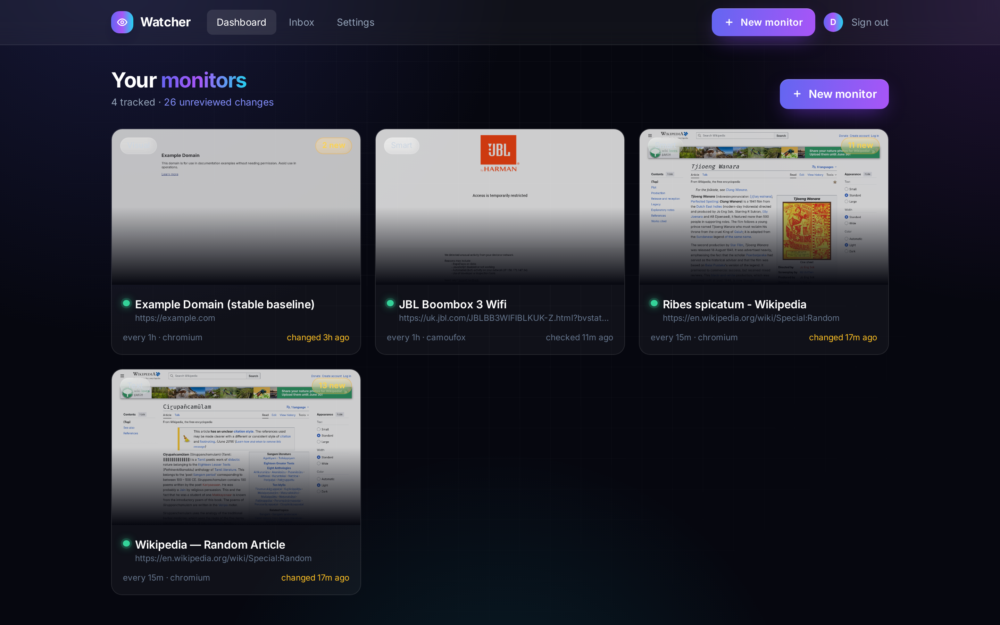
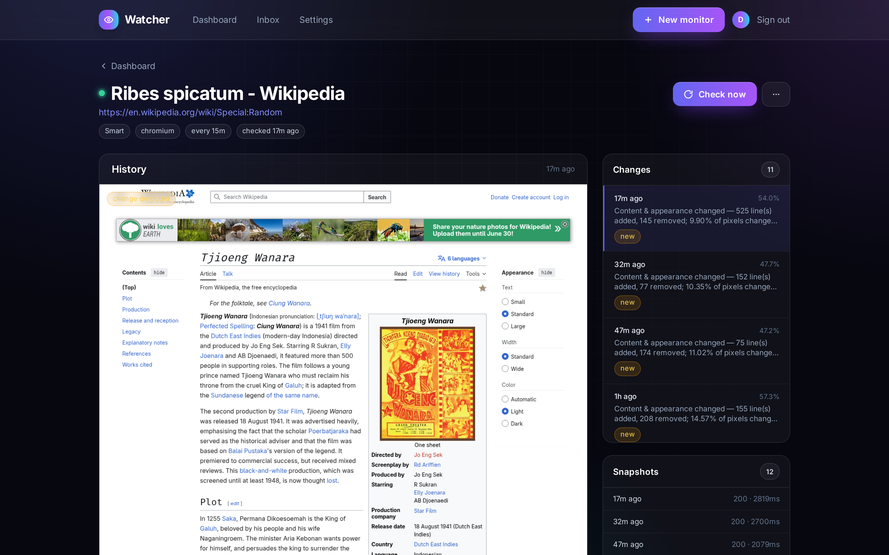
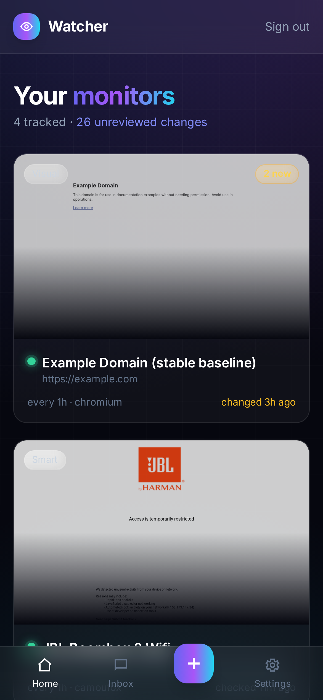

<h1 align="center">👁 Watcher</h1>

<p align="center">
  <strong>A self-hosted tool to monitor any website or URL for changes — and tell you the moment something moves.</strong>
</p>

<p align="center">
  Pages are rendered in a <em>real browser</em> (Playwright / Camoufox), so JavaScript-heavy and
  anti-bot–protected sites work where naïve HTML-diff scrapers fail.
</p>

<p align="center">
  
  
  
  
</p>

---

## ✨ Features

- **Smart detection (default)** — watches a page's **content (text) and appearance (visual) together**, and shows you both in a tabbed diff. Other modes available: rendered **text**, **visual** (screenshot), single **element** (CSS/XPath), raw **HTML**, and **JSON**.
- **Real browser rendering** — Chromium / Firefox / WebKit via Playwright, plus **[Camoufox](https://github.com/daijro/camoufox)** (stealth Firefox) for anti-bot targets.
- **Sees changes in place** — dashboard cards show live screenshot thumbnails; the diff viewer overlays **changed regions in red** on the actual page, with an interactive **before/after slider**.
- **History time-machine** — scrub through every captured render over time with a slider.
- **Auto-everything** — monitor names auto-populate from the page `<title>`; blocked / anti-bot challenge pages (DataDome, Cloudflare, PerimeterX, …) are detected and surfaced instead of silently failing.
- **Authenticated sites** — record a login flow; credentials are **encrypted at rest** and the session is reused between checks.
- **Noise control** — ignore selectors, regex ignore patterns, and a minimum-change threshold so trivial churn never alerts you.
- **Notifications** — in-app inbox, **Web Push**, and **HMAC-signed webhooks**.
- **Futuristic, fully-responsive UI** — dark glassmorphic design that works on desktop and mobile (with pinch-to-zoom snapshots).
- **Single container** — SQLite + a content-addressed blob store. No Redis, no Postgres, no external services.

## 📸 Screenshots

| Dashboard | Monitor detail (diff + history) |
|---|---|
|  |  |

<p align="center"></p>

## 🚀 Quick start (Docker)

```bash
git clone https://github.com/JameZUK/Watcher.git
cd Watcher
cp .env.example .env          # then set WATCHER_SECRET_KEY (and ideally WATCHER_ENCRYPTION_KEY)
docker compose up --build
```

Open **http://localhost:8000**, create an account, and add your first monitor. The Docker image bundles the Playwright browsers **and** Camoufox, so it works out of the box.

## 🧑‍💻 Local development

> Python **3.11–3.13** is recommended — the pinned dependencies have prebuilt wheels there. On 3.14+, install the latest releases instead of the pins, or just use Docker.

```bash
python -m venv .venv && source .venv/bin/activate
pip install -r requirements.txt
playwright install chromium          # browsers for local rendering
python -m camoufox fetch             # optional, for the Camoufox engine

export WATCHER_SECRET_KEY=dev-secret
uvicorn watcher.main:app --reload
```

## 🏗 How it works

```
schedule (APScheduler)  →  render (Playwright / Camoufox)  →  snapshot
        →  diff vs previous (detection)  →  store + notify (inbox / push / webhook)
```

- **Engines** implement one `Renderer` contract, so detection is engine-agnostic.
- Every render captures HTML, visible text, a full-page screenshot, and (for element mode) a selector value.
- Snapshots are **content-addressed** on disk — identical (unchanged) pages are stored once.
- A daily job prunes old snapshots but always preserves change-point snapshots, so diff history stays intact.

See **[SPEC.md](SPEC.md)** for the full design.

## ⚙️ Configuration

All settings are environment variables prefixed `WATCHER_` (see [`.env.example`](.env.example)). The essentials:

| Variable | Default | Purpose |
|---|---|---|
| `WATCHER_SECRET_KEY` | *(dev placeholder)* | Signs session cookies **and** webhook payloads. **Set this in production.** |
| `WATCHER_ENCRYPTION_KEY` | *(derived)* | Fernet key for encrypting login credentials. Set explicitly in production. |
| `WATCHER_DATA_DIR` | `data` | Where the SQLite DB and snapshot blobs live. |
| `WATCHER_MIN_INTERVAL_SECONDS` | `900` | Floor on how often a monitor can check (15 min). |
| `WATCHER_VAPID_PUBLIC_KEY` / `_PRIVATE_KEY` | — | Enable Web Push. Generate with `pip install py-vapid && vapid --gen`. |

### Webhook verification

Payloads are signed with HMAC-SHA256 in the `X-Watcher-Signature: sha256=<hex>` header:

```python
import hmac, hashlib
expected = "sha256=" + hmac.new(SECRET.encode(), request.body, hashlib.sha256).hexdigest()
assert hmac.compare_digest(request.headers["X-Watcher-Signature"], expected)
```

## 📁 Project layout

```
watcher/
  config.py, db.py, models.py, runner.py   # core (settings, ORM, the check pipeline)
  engines/      Playwright + Camoufox behind one interface
  detection/    text / visual / element / structured diffing + noise control
  auth/         users, password hashing (argon2), credential crypto, login flows
  scheduler/    APScheduler jobs
  notify/       push, webhook, inbox dispatch
  storage/      content-addressed blobs + retention
  web/          FastAPI routes, Jinja2 templates, static assets
```

## 🔒 Security notes

- Set a strong `WATCHER_SECRET_KEY` in production (signs sessions + webhooks).
- Login credentials are encrypted with Fernet; set `WATCHER_ENCRYPTION_KEY` explicitly rather than deriving it from the secret key.
- Watcher fetches arbitrary user-supplied URLs by design — only expose it to trusted users, ideally behind a reverse proxy with TLS.

## 📄 License

See [LICENSE](LICENSE).
